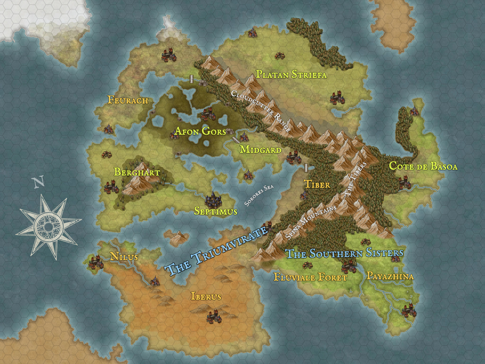

## Maps

### Septem Civita

Yellow labels are independent nation council members. Orange labels are fiefs that are either colonized by a council state or part on allied Council Seat, like the Triumvirate or Southern Sisters. Blue labels are for one of the above allied seats. 